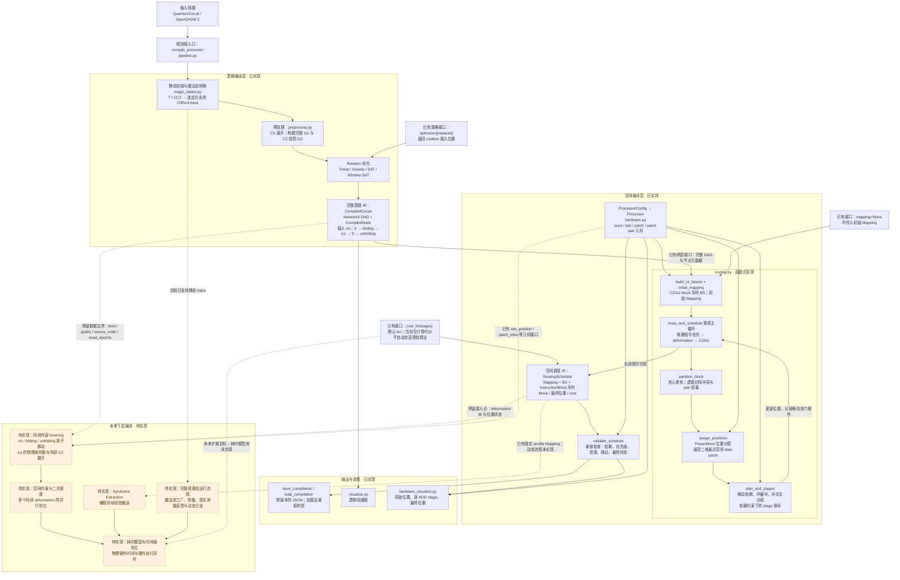

# 项目架构图

这是 Mermaid 流程图，用于描述当前项目架构。实线表示已实现流程；虚线表示未来接入关系。标注“待实现”的模块目前不参与编译。

使用支持 Mermaid 的 Markdown 编辑器（例如 Typora）打开本文件即可查看图形；VS Code 需要启用支持 Mermaid 的 Markdown 预览扩展。普通文本编辑器只能看到图的源码。

路由算法集中在 `routing.py`，图中各算法步骤不是独立的框架模块。

内部移动和二次调度目前仅保留 DAG、deformation IB、位置与几何数据的接入边界，没有已实现的插件接口或空接口类。
